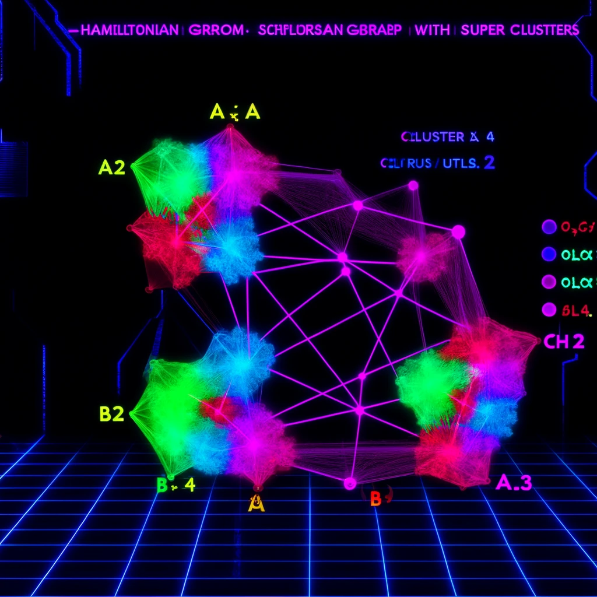

<link rel="stylesheet" type="text/css" href="styles.css">

# 🧙‍♀️✨ Qubits Neuron Class 🚀🌌

Quantum Qubit Example

This example demonstrates how to visualize a single qubit on the Bloch sphere using the <code>BlochSphere</code> and <code>Qubit</code> classes in Python.

# Create a qubit with equal superposition state

<code><pre> qubit = Qubit(a=1/np.sqrt(2), b=1/np.sqrt(2)) </code></pre>
# Plot the qubit on the Bloch sphere

<code><pre> qubit.plot_qubit() </code></pre>

  This code initializes a qubit in an equal superposition state and visualizes it on the Bloch sphere.

#### Hamiltonian Graph with Super Clusters

The goal is to simulate quantum holographic properties using a <a href="https://github.com/LilaShiba/neural_collective_network">complex neural network</a>.

## What is a Qubit? 🧩

A qubit is the basic unit of quantum information, just like a bit in classical computing. However, qubits are magical because they can be in a superposition of states! Kind of like gender 🧙‍♀️✨

In simple terms:

<ul>
    <li>A classical bit can be either <code>0</code> or <code>1</code>.</li>
    <li>A qubit can be in a state |0⟩, |1⟩, or any superposition α|0⟩ + β|1⟩ where α and β are complex numbers, just like us humans.</li>
    <li>α (alpha) is the amplitude for the state |0⟩.</li>
    <li>β (beta) is the amplitude for the state |1⟩.</li>
    <li>Note: This is in <a href="https://en.wikipedia.org/wiki/Hilbert_space">Hilbert Space💖</a></li>
    <li>Note: Layer class demands a Hamiltonian <a href="https://en.wikipedia.org/wiki/Hamiltonian_path"> Graph as the lower level diameter aka graph connectivity</a></li>
    <li>Note: Ideally and for ease sake this is an <a href="https://en.wikipedia.org/wiki/Orthonormality"> Orthonormal relationship, which you can't find in Brooklyn</a></li>
</ul>

Source: 1.) <a href="https://mitpressbookstore.mit.edu/book/9780262526678">MIT: A Gentle Introduction to Quantum Computing</a>

Source: 2.) <a href="https://mitpressbookstore.mit.edu/book/9780262038430">MIT: Holographic Quantum Matter</a>

    
Braket Notation in Quantum Mechanics 🧙‍♀️🔮

     
    
In quantum mechanics, <a href='https://en.wikipedia.org/wiki/Bra%E2%80%93ket_notation'>bra-ket notation is essential for representing quantum states and operations</a>.

    <ul>
        <li><strong>Ket |α⟩</strong>: Represents a quantum state vector. Example: |α⟩ could denote the state of a particle. 🌌</li>
        <li><strong>Bra ⟨β|</strong>: The conjugate transpose of a ket, representing the dual vector. 🔄</li>
        <li><strong>Inner Product ⟨β|α⟩</strong>: Probability amplitude between states |β⟩ and |α⟩. ✨</li>
        <li><strong>Outer Product |α⟩⟨β|</strong>: Operator that projects onto the state |α⟩. 🌀</li>
    </ul>
    
Example in a qubit system:

    <ul>
        <li><strong>Kets</strong>: |0⟩, |1⟩</li>
        <li><strong>Bras</strong>: ⟨0|, ⟨1|</li>
        <li><strong>Inner Product</strong>: ⟨0|1⟩ = 0 (orthogonality) 🌠</li>
        <li><strong>Outer Product</strong>: |0⟩⟨0| (projection operator) 🌙</li>
    </ul>

## Measuring a Qubit 🔍

When we measure a qubit, we "collapse" its superposition to one of the basis states:

<ul>
    <li>The probability of collapsing to |0⟩ is |α|2.</li>
    <li>The probability of collapsing to |1⟩ is |β|2.</li>
</ul>

### How It Works

<ol>
    <li><strong>State Vector:</strong> The qubit is in a state α|0⟩ + β|1⟩.</li>
    <li><strong>Probabilities:</strong> Calculate the probabilities |α|2 and |β|2.</li>
    <li><strong>Random Choice:</strong> Use these probabilities to randomly choose the measurement outcome.</li>
</ol>

### Example in Python

<pre><code>import numpy as np

class Ket:
    def __init__(self, alpha, beta):
        self.state_vector = np.array([alpha, beta], dtype=complex)

    def measure(self):
        probabilities = np.abs(self.state_vector) ** 2
        return np.random.choice([0, 1], p=probabilities)

# Example usage
alpha = 1/np.sqrt(2)
beta = 1/np.sqrt(2)
ket_instance = Ket(alpha, beta)
measurement_result = ket_instance.measure()
print(f"Measurement result: {measurement_result}")
</code></pre>

## Scales and Such

f is frequency (cycles per second), and &omega; is angular frequency (radians per second). The factor of 2&pi; comes from the fact that one complete cycle of oscillation corresponds to 2&pi; radians.

When discussing energy, it's important to understand the distinction between <strong>Joules per second</strong> and <strong>Joules per Kelvin</strong>.

### Joules per Second (J/s)

The term <strong>Joules per second</strong> refers to the rate of energy transfer or power. It is a measure of how much energy is being transferred or converted per second. The unit for this measurement is called a Watt (W), where:
<ul>
    <li>1 Watt (W) = 1 Joule per second (J/s)</li>
</ul>

### Joules per Kelvin (J/K)

The term <strong>Joules per Kelvin</strong> is used to describe a change in energy per change in temperature, specifically in the context of thermodynamics and heat capacity. It represents the amount of energy required to change the temperature of a system by one Kelvin (K). The unit is often used in the following contexts:
<ul>
    <li><strong>Heat Capacity (C):</strong> This is the amount of heat needed to change the temperature of a substance by one Kelvin. For example, if a substance has a heat capacity of 100 J/K, it means that 100 Joules of energy are needed to increase its temperature by 1 Kelvin.</li>
</ul>
</body>
